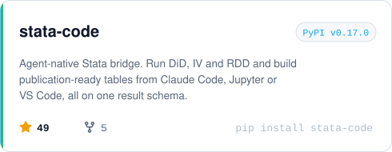
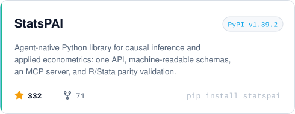
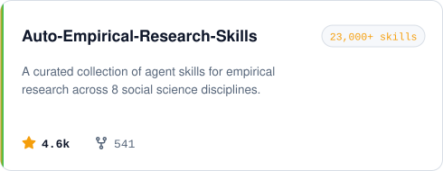
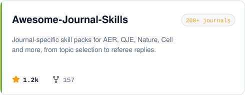
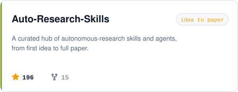
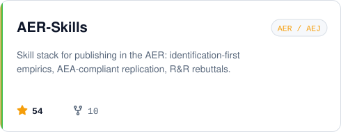

<div align="center">

<picture><source media="(prefers-color-scheme: dark)" srcset="assets/hero-dark.svg"></picture>

<p>
  <a href="https://www.copaper.ai"><b>CoPaper.AI</b></a> &nbsp;·&nbsp;
  <a href="https://brycewang-stanford.github.io/StatsPAI/">StatsPAI docs</a> &nbsp;·&nbsp;
  <a href="https://doi.org/10.21105/joss.10604">JOSS paper</a> &nbsp;·&nbsp;
  <a href="mailto:brycew6m@stanford.edu">brycew6m@stanford.edu</a>
</p>

</div>

I build the layer between coding agents and empirical research: estimators with machine-readable schemas, a bridge that lets agents drive Stata, and skill libraries that take an agent from raw data to a reproducible paper. Data Scientist at Stanford REAP and founder of [CoPaper.AI](https://www.copaper.ai).

<details>
<summary>The chart in the banner is real output. Reproduce it.</summary>

<br>

It is a Callaway–Sant'Anna event study on the `mpdta` replica bundled with StatsPAI: flat pre-trends, then a negative employment effect once the minimum wage rises.

```python
import statspai as sp

mp = sp.datasets.mpdta()
gt = sp.callaway_santanna(data=mp, y="lemp", t="year", i="countyreal", g="first_treat")
sp.aggte(gt, type="dynamic").plot()
```

</details>

## Tools

<p align="center">
  <a href="https://github.com/brycewang-stanford/stata-code"><picture><source media="(prefers-color-scheme: dark)" srcset="assets/card-stata-code-dark.svg"></picture></a>
  <a href="https://github.com/brycewang-stanford/StatsPAI"><picture><source media="(prefers-color-scheme: dark)" srcset="assets/card-StatsPAI-dark.svg"></picture></a>
</p>

```bash
pip install stata-code statspai
```

## Skill libraries

<p align="center">
  <a href="https://github.com/brycewang-stanford/Auto-Empirical-Research-Skills"><picture><source media="(prefers-color-scheme: dark)" srcset="assets/card-Auto-Empirical-Research-Skills-dark.svg"></picture></a>
  <a href="https://github.com/brycewang-stanford/Awesome-Journal-Skills"><picture><source media="(prefers-color-scheme: dark)" srcset="assets/card-Awesome-Journal-Skills-dark.svg"></picture></a>
  <a href="https://github.com/brycewang-stanford/Auto-Research-Skills"><picture><source media="(prefers-color-scheme: dark)" srcset="assets/card-Auto-Research-Skills-dark.svg"></picture></a>
  <a href="https://github.com/brycewang-stanford/AER-Skills"><picture><source media="(prefers-color-scheme: dark)" srcset="assets/card-AER-Skills-dark.svg"></picture></a>
</p>

## Product

<a href="https://www.copaper.ai"><picture><source media="(prefers-color-scheme: dark)" srcset="assets/copaper-dark.svg"></picture></a>

<br>

<div align="center">

<picture><source media="(prefers-color-scheme: dark)" srcset="assets/footer-dark.svg"></picture>

</div>
